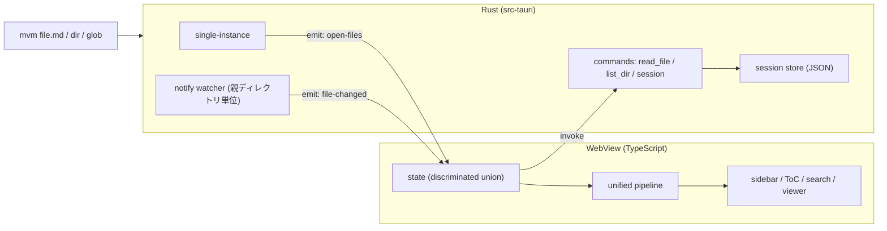

# mvm 設計

[k1LoW/mo](https://github.com/k1LoW/mo) を参考にした、Tauri v2 製のスタンドアロン Markdown ビューア。

## 方針

- mo は Go の HTTP サーバとブラウザ SPA の構成である。mvm は HTTP サーバを持たず、Tauri ウィンドウ内の SPA と Rust 側のファイル処理で構成する。
- Markdown のレンダリングはフロントエンド(TypeScript)で行う。Mermaid、KaTeX、Shiki はどの方式でもフロントで描画するため、Rust 側でパースしない。
- Rust 側の責務は、ファイル読み込み、ファイル監視、CLI 引数処理、single-instance、セッション永続化に限定する。

## 決定事項と除外

| 項目 | 決定 |
|---|---|
| グループ(mo の `-t`) | 実装しない。ただしタブとして扱う前提で状態モデルとセッション形式を設計する |
| stdin 入力 | 実装しない |
| MDX | 実装しない |
| UI フレームワーク | React |
| 対象 OS | Linux と Windows を先行し、macOS は後 |
| mo のサーバ系機能(`--port` / `--bind` / `--status` / `--shutdown` / `--restart` / リモートアクセス) | HTTP サーバがないため廃止 |

## アーキテクチャ

### mo との対応

| mo | mvm |
|---|---|
| 1ポート1サーバ、既存サーバへの POST でファイル追加 | `tauri-plugin-single-instance`。2つ目の起動時に `argv` と `cwd` を受け取り、アクティブなタブにファイルを追加する |
| SSE による live reload | Rust の `notify` で監視し、Tauri のイベントでフロントへ通知する |
| ドラッグ&ドロップ(メモリ読み込みで live reload 不可) | `onDragDropEvent` で絶対パスを取得するため live reload が有効 |
| `$XDG_STATE_HOME/mo/backup/mo-<port>.json` | アプリデータディレクトリに JSON を原子的に保存する |

### 設計判断

1. **ファイル読み込みと監視は fs プラグインを使わず、自前の Rust コマンドと `notify` で実装する。** `tauri-plugin-fs` は任意パス読み取りにスコープの明示が必要で、任意の Markdown を開く用途ではスコープが広くなる。自前コマンドなら capabilities を最小にできる。`src-tauri/capabilities/*.json` には `core:default` が必要で、変更後は `tauri dev` の再起動が要る(Growi: `/knowledge/libraries/rust/tauri/capabilities`)。
2. **監視は親ディレクトリ単位で行い、参照カウントで管理する。** 多くのエディタは一時ファイルへの書き込み後に rename で保存するため、ファイル単位の監視では通知が途絶えるおそれがある。監視はタブとは独立し、全タブのファイル集合から導出する。
3. **相対パス画像は asset protocol で表示する。** `convertFileSrc` で変換し、開いた Markdown のディレクトリだけを実行時にスコープへ追加する。静的スコープに `**/*` は許可しない。
4. **サニタイズと CSP を有効にする。** `rehype-raw` で生 HTML を通すため `rehype-sanitize` が必須。CSP の `img-src` に `asset:` と `http://asset.localhost` を許可する。Markdown 内のリンクは WebView 内遷移を禁止し、外部 URL は OS のブラウザで開く。
5. **フロントの状態は discriminated union で表現する。** ファイルは `loading | loaded | missing | error`。ファイル ID は branded type で、絶対パスの SHA-256 先頭8桁とする(mo と同方式)。

## タブの前提(UI は未実装)

M1〜M2 ではタブ UI を作らず、`tabs` が常に1要素の状態として動かす。後からタブ UI を足すときに、状態モデルとセッション形式の変更を不要にするのが目的。

- 状態: `AppState = { tabs: Tab[]; activeTabId: TabId }`、`Tab = { id: TabId; title: string; files: FileId[]; activeFileId: FileId | null }`。ファイルの内容と状態は、タブの外の `files: Record<FileId, FileEntry>` に持つ。同じファイルを複数タブで開いても、内容と監視は1つで済む。
- セッション JSON: `{ version: 1, tabs: [...], activeTabId }`。単一リストをトップレベルに置く形式にはしない。
- イベント: `open-files` のペイロードは `{ files: OpenedFile[]; tabId?: TabId }`(Rust がパスを解決・登録した後の値)。省略時はアクティブなタブに追加する。`file-changed` はタブに依存せずファイル単位で発行する。
- CLI: 今回はタブを指定するフラグを持たない。追加するときは mo の `-t` 相当を `--tab` として足す。

## 技術スタック

| 層 | 選定 |
|---|---|
| シェル | Tauri v2 |
| Rust crate | `tauri-plugin-single-instance`、`tauri-plugin-dialog`、`notify`(+ debouncer)、`serde`、`sha2` |
| フロント | TypeScript、Vite、React 19、Tailwind CSS v4 |
| Markdown | unified(remark-parse、remark-gfm、remark-rehype、rehype-raw、rehype-sanitize、rehype-slug、@shikijs/rehype)+ hast-util-to-jsx-runtime。M2 以降で remark-math、rehype-katex、rehype-github-alerts、mermaid を追加 |
| パッケージ管理 | pnpm |
| テスト | vitest、`cargo test`。E2E は `tauri-driver` を検討し、ビルド済みバイナリを対象にする。CI で開発サーバは使わない |
| 開発環境 | `flake.nix` + direnv(NixOS)。WebKitGTK など Tauri の Linux 依存を含める |
| 配布 | Linux は AppImage/deb、Windows は msi/nsis、macOS は dmg。OS ごとの CI マトリクスでビルドする |

Windows 向けビルドは WSL の UNC パス上で行うとコンパイルがクラッシュするため、Windows 側のファイルシステムで行う(Growi: `/knowledge/libraries/rust/tauri/wsl-windows-build`)。

## 実装範囲

1. **M1**: CLI でファイルを開く / GFM・Shiki・相対画像 / 保存時の live reload / single-instance / ダーク・ライトテーマ
2. **M2**: ディレクトリ・glob 監視 / サイドバー(ツリー)・ToC・全文検索 / ドラッグ&ドロップ・ダイアログでの追加 / Mermaid・KaTeX・GitHub Alerts / セッション永続化
3. **M3**: フォントサイズ・本文幅 / frontmatter 折りたたみ / Raw 表示とコピー / 画像・Mermaid のズーム / `.md` の関連付け / 配布 CI

## M1 の実装で確定した事項

- `@shikijs/rehype` は非同期プラグインのため、同期の `react-markdown` では変換に失敗する(描画時に例外となる)。`unified().run()` で hast を得て `hast-util-to-jsx-runtime` で React 要素に変換する。変換は `src/lib/pipeline.ts`(Tauri 非依存、vitest で検証)に分離している。
- Shiki の Oniguruma は WASM を使うため、CSP の `script-src` に `'wasm-unsafe-eval'` が必要。
- `ErrorBoundary` を表示領域に置く。描画中の例外でアプリ全体が空白になるのを防ぐ。
- 実行時の asset スコープ追加は `app.asset_protocol_scope().allow_directory(dir, true)`(Tauri 2.12)。スコープは開いたファイルのディレクトリ配下のみのため、親ディレクトリ(`../img/` など)の画像は表示できない想定(未確認)。
- 親ディレクトリ監視は、一時ファイルへ書き込んでから rename する保存方式でも live reload が動作する(Linux で確認)。
- `img-src` は `https:` を許可している。外部画像(README のバッジなど)を表示するためで、リモート画像による閲覧の追跡は許容している。

## M2 の実装で確定した事項

### CLI

`mvm [-R] [-w] <file | dir | glob>...`

| 引数 | 動作 |
|---|---|
| ファイル | そのまま開く(拡張子は問わない) |
| ディレクトリ | 直下の Markdown(`md` / `markdown` / `mdown` / `mkd`)を開く。`-R` で再帰する。`.` 始まりのディレクトリ、`node_modules`、`target` は辿らない |
| glob | `*` `?` `[` を含む引数。cwd 基準で展開する。`**` を含むと再帰とみなす |
| `-w` | 展開元(ディレクトリ・glob)を監視パターンとして登録し、一致する新規ファイルを自動で開く |

- 1回の展開で開くファイル数は1000件が上限。
- 未知のフラグは無視する(GTK 等が付与する引数を拒否しないため)。
- 2つ目の起動(single-instance)も同じ引数を解釈し、既存ウィンドウの先頭の新規ファイルを選択する。監視パターンによる自動追加では選択を変えない。

### 監視パターンとセッション

- 保存先は `app_data_dir()/session.json`(`version: 1`)。タブ、各タブのファイルパスと選択中ファイル、監視パターン、閉じたファイルを持つ。一時ファイルへ書いて rename する。
- フロントは状態が変わるたびに 300ms のデバウンス後に保存する。復元が終わるまで保存しない(保存済みセッションを空の状態で上書きしないため)。
- 起動時は、保存済みセッションを復元してから、監視パターンを再走査して前回終了後に増えたファイルを加え、最後に起動引数のファイルを開く。
- 閉じたファイルは `closed` に記録し、監視パターンが再度開かないようにする。明示的に開くと記録から外れる。
- 監視パターンを解除する UI は未実装。解除するには `session.json` の `patterns` を編集する。

### 描画

- 数式は `remark-math` + `rehype-katex`、GitHub Alerts は `rehype-github-alerts`、Mermaid は最初の図を描画するときに動的 import する。いずれも sanitize の後段に置く。
- `rehype-github-alerts` は名前付きエクスポートのみ。デフォルトインポートは `undefined` になり、`unified().use(undefined)` はエラーにならず何もしない。
- Mermaid は `securityLevel: "strict"` で描画し、ダーク/ライトの切替に追従して再描画する。構文エラーの図は、エラー文とソースを表示する。
- 目次は hast の見出し(`rehype-slug` が付けた id)から生成する。幅が狭いウィンドウでは非表示(`xl` 以上で表示)。

### 検証状況

- ヘッドレス Wayland(cage)で、ディレクトリの再帰展開、ツリー表示、目次、数式、アラート、Mermaid(正常系と構文エラー)、監視パターンによる新規ファイルの自動追加、2つ目の起動によるファイル追加、セッション復元、検索(`Ctrl+K`)を確認した。
- ドラッグ&ドロップとファイル選択ダイアログは、ポインタ操作とデスクトップポータルが必要なため未確認。

## M3 の実装で確定した事項

- 表示設定(文字サイズ4段階、本文幅の狭/広)は `localStorage` の `mvm.settings` に保存する。不正な保存値は項目ごとに既定値へ戻す。本文幅は `max-w-3xl` / `max-w-6xl` で、実際の幅はウィンドウ幅とサイドバー・目次の幅で制限される。
- サイドバーはヘッダー左端の ☰ ボタンまたは `Ctrl+B`(macOS は `Cmd+B`)で表示/非表示を切り替える。開閉状態は `mvm.settings` の `sidebarOpen` に保存する。非表示の間もアンマウントせず `display: none` にし、検索語とツリーの折りたたみ状態を保つ。非表示中の `Ctrl+K` は表示に戻してから検索欄にフォーカスする。
- スクロール位置はファイルごとに記憶し(`src/lib/scrollMemory.ts`)、ファイルを切り替えたときに復元する。位置はメモリ上のみで、再起動後は先頭から表示する。内容は非同期に描画され、画像や Mermaid の図で高さが後から変わるため、目標位置に届くまで内容のサイズ変化(`ResizeObserver`)のたびに再適用する。ユーザーの操作(ホイール、タッチ、キー、ポインタ)か 2 秒で打ち切る。復元中の `scroll` イベントは保存しない(内容の入れ替えで `scrollTop` が丸められた値を、新しいファイルの位置として上書きしないため)。
- YAML frontmatter は先頭の `---` から次の `---` 行までを分離し、折りたたみ(`
`)で表示する。Markdown の変換対象には含めない。閉じ行がない場合は frontmatter として扱わない。
- Raw 表示は元のテキストをそのまま表示する。文字サイズと本文幅の設定に連動する。
- コピーは Markdown(元のテキスト)、テキスト(`innerText`)、HTML(`innerHTML`)の3種類。`navigator.clipboard` を使い、使えない場合は `execCommand("copy")` に切り替える。テキストと HTML は Raw 表示中は選択できない。
- 画像と Mermaid の図をクリックすると、`react-zoom-pan-pinch` による全画面モーダルで拡大・パンできる。Esc または背景のクリックで閉じる。Mermaid の図はキーボード(Enter)でも開ける。図は背景が透明なため、半透明の背景越しにページが重なると線が見えなくなる。図は不透明なパネル(ライトは白、ダークは `neutral-900`。Mermaid の配色がテーマに追従するため、線とパネルのコントラストが保たれる)に載せる。
- `.md` の関連付けは `bundle.fileAssociations`(`md` / `markdown` / `mdown` / `mkd`、`role: Viewer`)で設定する。
  - Tauri が生成する `.desktop` は `Exec=mvm` で `%F` が付かず、ファイルマネージャーからの起動でパスが渡らない。`src-tauri/desktop-template.desktop` を `bundle.linux.deb.desktopTemplate` / `rpm.desktopTemplate` に指定し、`Exec={{exec}} %F` としている(deb で生成結果を確認)。
  - macOS は Finder からの起動時に引数ではなく `RunEvent::Opened` でパスが渡されるため、現状は未対応(関連付けはするが、開いたファイルは表示されない)。
- CI(`.github/workflows/ci.yml`)は、フロント(型検査、テスト、ビルド)と Rust(clippy `-D warnings`、テスト。Ubuntu / Windows / macOS)を実行する。Rust のビルドには `dist/` が必要なため、先にフロントをビルドする。開発サーバは使わない。
- リリース(`.github/workflows/release.yml`)は `v*` タグの push で、`tauri-apps/tauri-action` により Ubuntu / Windows / macOS(arm64 と Intel)の配布物をドラフトリリースに添付する。シークレットは `GITHUB_TOKEN` のみ。コード署名と公証は未設定。
- どちらのワークフローも `actionlint` で検証したが、GitHub 上では未実行。

## Excel(.xlsx)の表示

### 方針

対象の設計資料(業務フロー図)は、セルがほぼ空で、内容の大半が図形(`xdr:sp` / `xdr:cxnSp` / `xdr:pic`)である。ExcelJS は描画の配置を解釈する処理が画像(`xdr:pic`)だけで、図形とグラフを読み捨てるため、`xl/drawings/drawingN.xml`(DrawingML)を自前で解析して SVG に描画する。

### 構成

- Rust: `read_bytes(id)` が、バイト列を `tauri::ipc::Response` で返す(JSON の数値配列にしない)。ファイル種別の判定は拡張子(`xlsx`)で、Markdown は従来どおり `read_markdown`。登録・監視・セッションは Markdown と共通で、ディレクトリの展開対象にも `xlsx` を加えた。Excel の一時ファイル(`~$name.xlsx`)は除く。
- フロント(`src/lib/xlsx/`): zip の展開に `fflate`、XML の解析に `@xmldom/xmldom` を使う(ブラウザの `DOMParser` ではなく xmldom にして、vitest(Node)でも同じ実装で検証できるようにした)。`xml.ts`(名前空間の接頭辞を無視する走査)、`color.ts`、`theme.ts`、`styles.ts`、`numfmt.ts`、`sheet.ts`(セル・列幅・行高・結合)、`layout.ts`(座標)、`drawing.ts`(図形)、`geometry.ts`(プリセット図形の SVG パス。純関数)、`workbook.ts`(zip 全体)。
- 表示: `SheetSvg.tsx` がシート全体を 1 つの SVG に描き、`XlsxView.tsx` がシートのタブ、拡大縮小、ドラッグでの移動を持つ。テキストは SVG の `<text>` ではなく `<foreignObject>` に HTML を置き、折り返し・揃え・縦書きをブラウザに任せる。`XlsxView` は xlsx を開くときだけ読み込む(別チャンク約 125KB)。

### 座標と寸法

- 図形の位置は、アンカー(`from` / `to` のセルと EMU のオフセット)から求める。列幅は文字数なので、`px = round(width × mdw)`(mdw は既定フォントの最大桁幅)。mdw は、既定フォントが Calibri・Arial などなら 7、それ以外(Meiryo UI、游ゴシック)は 8 とした。13 ファイルで、図形の絶対座標(`xfrm`)とアンカーから求めた位置の差が最小になる値(8)を選んだ。行高は `pt × 96/72`。
- 回転した図形のアンカーは、回転後の外接矩形になる。`xfrm` の `ext` は回転前の大きさなので、外接矩形との拡縮比で補正した回転前の矩形を、アンカーの中心に置く(`unrotatedRect`)。補正しないと、90° 回転したコネクタが 90° 倒れた長さで描かれる。
- グループの子は、`chOff` / `chExt` の座標系から、グループの絶対矩形への変換で配置する(入れ子に対応)。
- 回転と反転は、図形の中心を基準にした SVG の変換で表す。テキストは反転させず、反転した図形に対しては、テキスト領域だけを鏡像の位置に置く。

### スタイル

- 図形の塗りと線は、`spPr` の指定を優先し、なければ `xdr:style` の参照(`fillRef` / `lnRef` / `fontRef`)の色を使う。線幅は、`ln@w` がなければテーマの `lnStyleLst` の `lnRef idx` 番目。
- 色は `srgbClr` / `schemeClr` / `sysClr` / `prstClr` に対応し、変換 `lumMod` / `lumOff`(HSL の明度)、`tint`、`shade`、`alpha` を文書順に適用する。
- 矢印の端点は、色・種類・大きさの組ごとに SVG の `<marker>` を作る(`context-stroke` に依存しない)。
- 縦書きは、`vert` が文字を 90° 回転、`eaVert` が日本語の縦書き、`vert270` が 270° 回転で、CSS の `writing-mode` と `text-orientation` に対応させる。
- 初期倍率は、シートに保存された `zoomScale` を使い、なければ幅に合わせる。ファイルが更新されて再読み込みされたときは、選択中のシートと倍率を保つ。

### 対応範囲と制約

- 図形は 18 種類(`rect`、`roundRect`、`ellipse`、`triangle`、`diamond`、`flowChartInputOutput`、`flowChartDocument`、`flowChartMagneticDisk`、`foldedCorner`、`wedgeRectCallout`、`wedgeRoundRectCallout`、`arc`、`line`、`straightConnector1`、`bentConnector2` から `5`)。サンプル 13 ファイルの図形をすべて含む。未対応の種類は外接する矩形で代用し、種類と個数をツールバーに出す。
- 画像は PNG / JPEG / GIF / SVG / BMP / WebP に対応する。Excel は PNG を本体にし、SVG を拡張(`svgBlip`)に持つため、SVG があれば優先する。EMF / WMF は対象外。
- 未対応: グラフ(`graphicFrame`)、SmartArt、条件付き書式、セル内のリッチテキスト(プレーンテキストで表示)、ウィンドウ枠の固定、パターン塗りと画像塗り(パターンは前景色の単色で近似、画像塗りは塗りなし)、セルのグラデーション塗り(先頭の色の単色)、`.xls` と `.xlsm`。
- 本文の検索は Markdown のみ。Excel はファイル名が対象。
- Excel のフォント(Meiryo UI など)がない環境では代替フォントになり、文字の折り返し位置が変わる。折り返しやクリップは再現せず、図形の外にはみ出した文字はそのまま表示する。

### 検証

- 単体テスト: 幾何(`geometry.test.ts`)、数値書式、色、回転図形の補正、合成した xlsx(`workbook.test.ts`。zip を `fflate` で組み立て、結合・グループ変換・回転コネクタ・画像・未対応図形の報告を検証)。
- 実ファイル: `samples.test.ts` は、環境変数 `XLSX_SAMPLES` にフォルダを指定したときだけ実行する(資料は非公開で、リポジトリに含めない)。13 ファイルの全シートが例外なく解析でき、図形の個数が XML の集計と一致した(例: 1 シートのファイルで 649 + 263 + 51 = 963)。
- 実機(ヘッドレス Wayland): 3 ファイルを表示して確認した。LibreOffice で PDF に変換した出力とも目視で比較した。回転したコネクタの位置、縦書きの向き、再読み込み時の状態保持は、この確認で見つかった不具合を修正した。
- 実機で確認していない: Windows と macOS での表示、Excel 本体との画素単位の比較。

## 未検証事項

実装前に context7 または実機で確認する。

- `dragDropEnabled` を有効にしたとき、Windows で WebView 内の HTML5 DnD が無効になるか
- `bundle.fileAssociations` の設定方法
- ドラッグ&ドロップ(`onDragDropEvent`)とファイル選択ダイアログの実機動作
- 配布物のインストールと起動(CI は 2026-10-05、リリース `release.yml` は v0.1.0 のタグ push で全ジョブ成功し、ドラフトリリースに deb / rpm / AppImage / msi / NSIS / dmg(arm64・Intel)を添付できた。生成物は起動して確認していない)
- ファイルマネージャーのダブルクリックで `.md` が開くこと(`.desktop` の内容のみ確認)
- macOS の `RunEvent::Opened` への対応
- Windows / macOS での GUI の動作(CI でビルドとテストのみ確認。Linux 以外では起動して確認していない)
- Excel: 図形・グラフ・SmartArt を含む他の資料での再現度(確認したのは業務フロー図 13 ファイルのみ)
- mo の監視ライブラリが fsnotify か fswatcher か(mo の CLAUDE.md と go.mod の記述が食い違っている。ソース未読)
